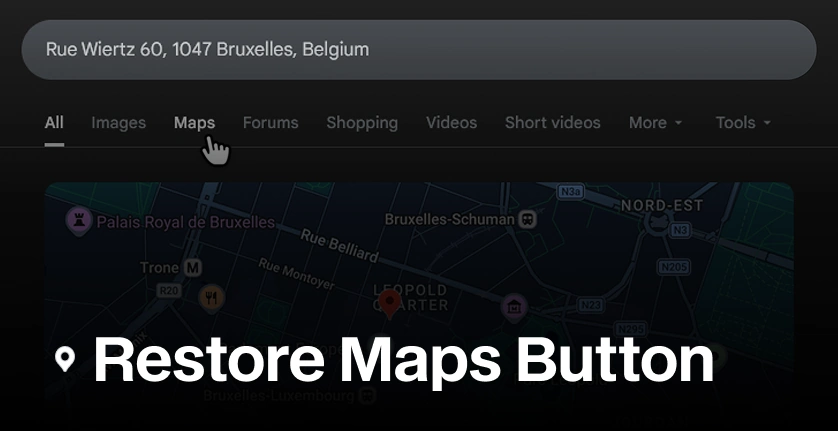

# Restore Google Maps Button

## About

Restore Google Maps Button is a browser extension that brings back the “Maps” button in Google search results.

The button was removed in Europe due to the **Digital Markets Act (DMA)**, an EU law that took effect in 2024 requiring Google to avoid favoring its own services (like Google Maps) in search results to ensure fair competition.

## Installation (Dev)

### Firefox

1. Open `about:debugging`.
2. Click **This Firefox**.
3. Click **Load Temporary Add-on**.
4. Select the project's `manifest.json` file.
